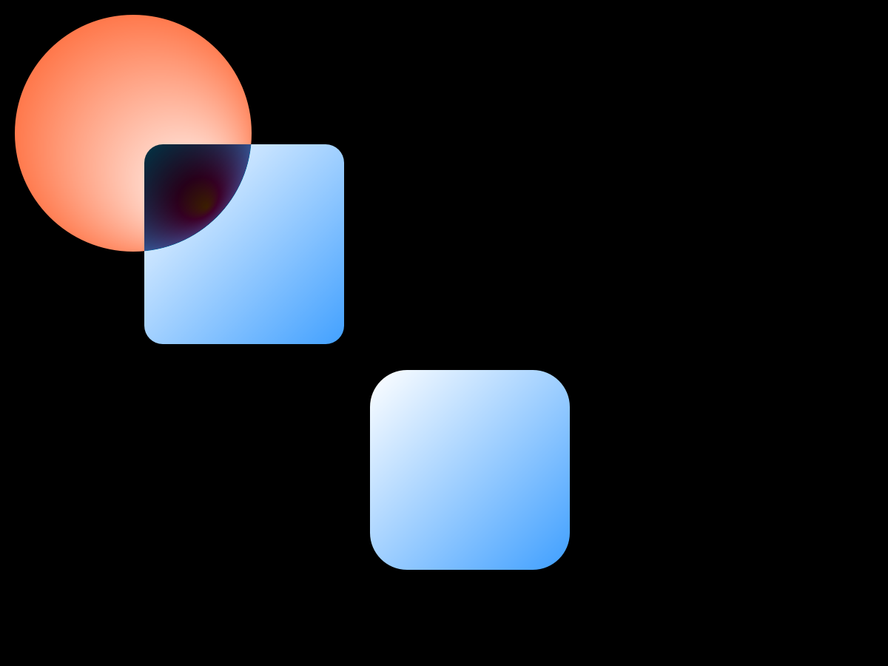
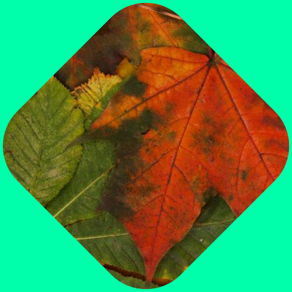
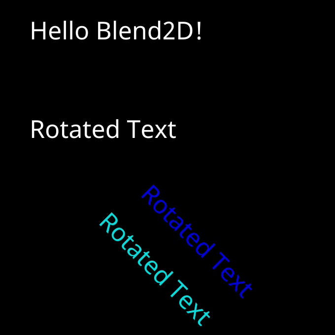

  
  
  
  

# Blen2d4Delphi
Blen2d4Delphi is alive again! [fatihtsp]

### Overview
Blend2D (https://blend2d.com & https://github.com/blend2d/blend2d) is a high performance 2D vector graphics engine written in C++ and released under the Zlib license. The engine utilizes a built-in JIT compiler to generate optimized pipelines at runtime and is capable of using multiple threads to boost the performance beyond the possibilities of single-threaded rendering. Additionally, the engine features a new rasterizer that has been written from scratch. It delivers superior performance while quality is comparable to rasterizers used by AGG and FreeType. The performance has been optimized by using an innovative approach to index data that is built during rasterization and scanned during composition. The rasterizer is robust and excels in rendering complex vector art and text.

The api porting of Blen2d for Delphi was started by #neslib orginally (Erik van Bilsen: https://github.com/neslib/DelphiBlend2D) but not continued updates after some version. I guess due to frequent code changes in the orginal Blend2d API makes difficult to port it to Delphi. I've completely port to Blend2d api using neslib's study (the dll file blend2d_win64.dll should be at the executable files the same directory, here bin directory includes the dll file). Here, the given dll file has object declerations (const. & destr.) and can be called from Delphi. The Delphi samples works, please test. Also, the comparisons with FMX have been given.

### Getting Started
* Dowload the Blen2d4Delphi repository: git clone https://github.com/fatihtsp/Blen2d4Delphi
* Open the Delphi package (/packages/Blend2DPackages.groupproj) and add the source paths to Delph search path, then compile the projects "1) RtlBlend2D.dproj & 2) VclBlend2D.dproj & 3) FMXDBlend2D.dproj" and install (if you want). It should be compiled.
* Open the getting started project group from samples/GettingStarted/GettingStarted.groupproj
* Choose the 1st project "blGettingStarted01.dproj" from the project list and open the dpr file, and play, should be compiled... Have fun.

### Samples
Works

### Delphi
Forever.

{fatihtsp}
